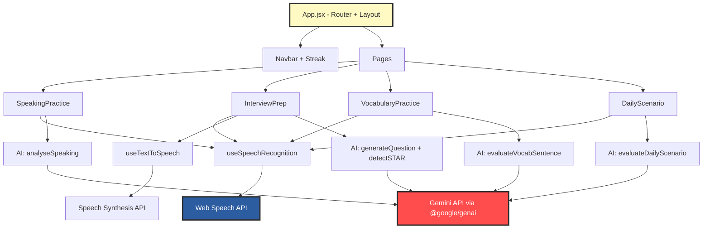

# Fasih — Implementation Plan

AI-powered English speaking practice for remote & global work. Built with the **Hand-Drawn** design system aesthetic.

## Summary

Build a single-page web application using **React + Vite + TailwindCSS + TanStack Router** with a hand-drawn, sketch-on-paper visual identity. The app has 4 features (3 core + 1 bonus) centered around speaking practice with AI feedback powered by **Gemini 2.0 Flash**.

> [!IMPORTANT]
> This is a **hackathon project** (JuaraVibeCoding by Google). No backend, no auth, no database — all state lives in React. Priority is a polished, impressive demo flow.

---

## User Review Required

> [!IMPORTANT]
> **API Key Strategy**: The PRD specifies Gemini 2.0 Pro. For a hackathon with no backend, the API key must be embedded client-side or entered by the user at runtime. I recommend a simple "Enter your API key" modal on first visit, stored in `localStorage`. Please confirm.

> [!WARNING]
> **Speech API Limitations**: Web Speech API (SpeechRecognition) has inconsistent browser support — works best in Chrome. Firefox/Safari support is limited. Should we show a "Use Chrome for best experience" banner, or implement a Gemini-based fallback for transcription?

## Open Questions

1. **Gemini Model**: PRD says "gemini 3.0 pro" — should we use `gemini-2.0-flash` (faster, cheaper, good for hackathon) or `gemini-2.5-pro` (higher quality)?
ans: its okay
2. **Deployment**: PRD mentions Vercel. Should I configure Vercel deployment, or is local dev sufficient for the hackathon demo?
ans: dont configure anything
3. **Language**: Should the UI text (buttons, labels, navigation) be in **English** or **Bahasa Indonesia**? The practice content will be English, but the chrome/UI could be either.
ans: provide i18n to change between bahasa and english
4. **Streak Counter**: The PRD mentions a daily streak counter. Without a backend/auth, this would use `localStorage`. Is that acceptable, or should we skip this?
ans: skip streak for now
---

## Proposed Changes

### Phase 1 — Project Foundation

Set up the React + Vite project, install dependencies, configure TailwindCSS, and establish the Hand-Drawn design system as reusable tokens/utilities.

#### [NEW] Project Initialization (via CLI)

```bash
npx -y create-vite@latest ./ --template react
```

**Dependencies to install:**
- `tailwindcss @tailwindcss/vite` — styling
- `@tanstack/react-router` — client-side routing
- `lucide-react` — icons (stroke-width 2.5–3, enclosed in rough circles)
- `@google/genai` — Gemini AI SDK
- `react-hot-toast` or `sonner` — toast notifications

**Google Fonts to load (via `<link>` in index.html):**
- `Kalam:wght@700` — headings (felt-tip marker)
- `Patrick Hand:wght@400` — body text (handwritten)

#### [NEW] `tailwind.config.js`

Configure the Hand-Drawn design system tokens:

| Token | Value | Usage |
|:------|:------|:------|
| `colors.paper` | `#fdfbf7` | Page background |
| `colors.pencil` | `#2d2d2d` | Text, borders |
| `colors.erased` | `#e5e0d8` | Muted surfaces |
| `colors.marker` | `#ff4d4d` | Accent / CTA hover |
| `colors.pen` | `#2d5da1` | Secondary accent |
| `colors.postit` | `#fff9c4` | Feature card bg |
| `fontFamily.heading` | `Kalam, cursive` | Headings |
| `fontFamily.body` | `Patrick Hand, cursive` | Body text |
| `boxShadow.hard` | `4px 4px 0px 0px #2d2d2d` | Standard shadow |
| `boxShadow.hard-lg` | `8px 8px 0px 0px #2d2d2d` | Emphasized shadow |
| `boxShadow.hard-sm` | `2px 2px 0px 0px #2d2d2d` | Hover/pressed shadow |

Custom CSS utilities for wobbly borders:
```css
.wobbly {
  border-radius: 255px 15px 225px 15px / 15px 225px 15px 255px;
}
.wobbly-md {
  border-radius: 15px 225px 15px 255px / 255px 15px 225px 15px;
}
.wobbly-sm {
  border-radius: 225px 15px 255px 15px / 15px 255px 15px 225px;
}
```

#### [NEW] `src/index.css`

Global styles:
- Paper texture background via `radial-gradient(#e5e0d8 1px, transparent 1px)` with `background-size: 24px 24px`
- Font defaults: `font-family: 'Patrick Hand'` on body
- Base heading styles with `font-family: 'Kalam'`
- Wavy underline utility class for nav links
- Tape decoration utility class

#### [NEW] `src/App.jsx`

Root layout with TanStack Router:
- Navbar (top)
- `<Outlet />` for page content
- Streak counter in top bar (localStorage-based)

#### [NEW] `src/routes/` — Page routing

| Route | Page | Priority |
|:------|:-----|:---------|
| `/` | Landing / Home | P0 |
| `/speaking` | Speaking Practice | P0 |
| `/interview` | Interview Prep | P1 |
| `/vocabulary` | Vocabulary Learning | P2 |
| `/daily` | Daily Office Scenario | P3 |

---

### Phase 2 — Reusable UI Components

Build the atomic design system components that every page will share.

#### [NEW] `src/components/ui/Button.jsx`

Hand-drawn button with wobbly borders:
- White bg, `border-[3px]` pencil border, hard offset shadow
- Hover: marker red bg, white text, shadow reduces, translate shifts
- Active: shadow disappears, translate increases (press-flat effect)
- Secondary variant: erased bg, hover to pen blue
- Props: `variant`, `size`, `disabled`, `onClick`, `children`

#### [NEW] `src/components/ui/Card.jsx`

Container with hand-drawn aesthetic:
- White bg, wobbly border, subtle hard shadow
- `decoration` prop: `"tape"` | `"tack"` | `"none"`
- Tape = translucent gray bar at top with slight rotation
- Tack = red circle thumbtack at top center
- Post-it variant with `#fff9c4` background

#### [NEW] `src/components/ui/Badge.jsx`

Small pill/tag element for:
- Filler word highlighting (marker red)
- Category tags (pen blue)
- STAR status badges (green/amber/grey)
- Wobbly border, small text

#### [NEW] `src/components/ui/ProgressBar.jsx`

Score visualization:
- Wobbly container border
- Filled portion with marker red or pen blue
- Score label in heading font
- Animated fill on mount

#### [NEW] `src/components/ui/ScoreCircle.jsx`

Circular score display (organic shape, not perfect circle):
- Varied border-radius for organic feel
- Score number in large heading font
- Label below in body font

#### [NEW] `src/components/ui/Modal.jsx`

Dialog overlay:
- Wobbly bordered card centered on screen
- Semi-transparent paper-colored backdrop
- Close button with tack decoration

#### [NEW] `src/components/layout/Navbar.jsx`

Top navigation bar:
- Logo "Fasih" in Kalam font with wavy underline
- Nav links: Speaking, Interview, Vocabulary, Daily
- Streak counter (🔥 icon + day count)
- Wobbly bottom border (dashed)
- Mobile: hamburger menu

#### [NEW] `src/components/layout/PageHeader.jsx`

Consistent page title section:
- Large heading in Kalam font
- Subtitle in Patrick Hand
- Optional decorative elements (arrows, squiggles)

---

### Phase 3 — Speaking Practice (P0 Core)

The centrepiece feature. Random office topic → record speech → AI feedback.

#### [NEW] `src/pages/SpeakingPractice.jsx`

**Three-state page flow:**

1. **Topic Selection State**
   - Card showing random office scenario topic
   - Category badge (Meeting / Escalation / Feedback / Async / Onboarding)
   - "Shuffle" button (secondary) to get new topic
   - "Start Speaking" button (primary CTA)
   - Hand-drawn arrow SVG pointing to CTA

2. **Recording State**
   - Large pulsing microphone icon (in rough circle)
   - Recording timer showing elapsed / 2:00 max
   - Live transcription text appearing in a "notebook" styled area (lined paper effect)
   - "Stop" button (marker red)
   - Waveform visualization (simple CSS bars with bounce animation)

3. **Feedback State** (confidence-first layout)
   - **Positive Note** card at top (post-it yellow, tack decoration) — shown FIRST
   - **Overall Score** in large ScoreCircle
   - **Score Breakdown** — 4 ProgressBars (clarity, professional_tone, vocabulary_range, grammar)
   - **Filler Words** — row of Badge pills highlighting detected fillers
   - **"How a Native Would Say It"** — list of {original → improved} sentence pairs in Card with tape decoration
   - **Suggestions** — 2-3 actionable tips in numbered list
   - "Try Another Topic" button to reset

#### [NEW] `src/hooks/useSpeechRecognition.js`

Custom hook wrapping Web Speech API:
- `startListening()`, `stopListening()`, `transcript`, `isListening`
- Auto-stop after 2 minutes
- Error handling for permission denied / unsupported browser
- Interim results for live transcription display

#### [NEW] `src/hooks/useAudioRecorder.js`

MediaRecorder API hook (backup for audio capture):
- `startRecording()`, `stopRecording()`, `audioBlob`
- Timer tracking

#### [NEW] `src/lib/ai.js`

Gemini API integration module:
- `initGemini(apiKey)` — initialize client
- `analyseSpeaking(topic, category, transcript)` — returns feedback schema
- System prompt: professional English coaching persona
- Temperature: 0.4, max tokens: 800
- Strict JSON output matching PRD schema

#### [NEW] `src/data/topics.js`

Static array of 25+ office scenario topics:
- Each: `{ id, topic, category }` 
- Categories: Meeting, Escalation, Feedback, Async, Onboarding
- `getRandomTopic()` function

---

### Phase 4 — Interview Prep (P1)

Multi-turn conversation with AI interviewer, STAR method detection, TTS question narration.

#### [NEW] `src/pages/InterviewPrep.jsx`

**Multi-step flow:**

1. **Setup Screen**
   - Role selector (cards): Software Engineer, Marketing, Designer, Product Manager, Data Analyst, General
   - Difficulty selector (3 cards): Screening Call, Behavioral, Culture Fit
   - Each card with post-it styling and tack decoration
   - "Start Interview" button

2. **Interview Session**
   - Current question displayed in large Card with tape decoration
   - TTS auto-reads the question aloud (Web Speech Synthesis API)
   - STAR indicator: 4 badges showing Situation/Task/Action/Result status
     - Green (detected), Amber (in progress), Grey (missing)
   - Recording UI (reuses speaking practice recording component)
   - After answering: possible follow-up question
   - Question counter: "Question 2 of 5"

3. **Session Summary**
   - Overall session score (ScoreCircle)
   - Per-answer breakdown cards
   - STAR completion percentage
   - Best answer highlight (post-it yellow)
   - Improvement areas (2 recurring weaknesses)
   - "Practice Again" button

#### [NEW] `src/hooks/useTextToSpeech.js`

Custom hook for Web Speech Synthesis:
- `speak(text)`, `isSpeaking`, `stop()`
- English voice selection

#### [NEW] `src/lib/ai.js` (extend)

Add to AI module:
- `generateInterviewQuestion(role, difficulty, previousQA)` — returns question + follow-up flag
- `detectSTAR(answer)` — returns STAR component detection
- `generateSessionSummary(allQA, role, difficulty)` — returns session feedback schema

#### [NEW] `src/components/interview/STARIndicator.jsx`

Visual STAR method badge row:
- 4 labelled badges: S / T / A / R
- Color-coded: green (detected), amber (in-progress), grey (missing)
- Wobbly badge borders

#### [NEW] `src/components/interview/QuestionCard.jsx`

Interview question display:
- Large card with tape decoration
- Question text in heading font
- Speaker icon button to replay TTS
- Question number badge

---

### Phase 5 — Vocabulary Learning (P2)

Flashcard-style vocab practice with spoken sentence evaluation.

#### [NEW] `src/pages/VocabularyPractice.jsx`

**Flow:**

1. **Category Selection**
   - 4 category cards (post-it style): Meetings, Email/Async, Feedback Culture, Remote Work Tools
   - Each with relevant icon in rough circle

2. **Vocab Card**
   - Word/phrase in large heading font
   - Context sentence shown first (context before definition)
   - "Reveal" button flips to show definition + category tag
   - After reveal: prompt to speak a sentence using the word
   - Recording UI (compact version)
   - AI evaluation: verdict badge (Natural ✅ / Correct but unnatural ⚠️ / Incorrect ❌)
   - Improved version if needed
   - "Next Word" button

#### [NEW] `src/data/vocabulary.js`

Static vocabulary dataset (30+ words):
- Each: `{ word, contextSentence, definition, category, difficulty }`
- Categories: Meetings, Email/Async, Feedback Culture, Remote Work Tools
- `getRandomVocab(category)` function

#### [NEW] `src/lib/ai.js` (extend)

Add:
- `evaluateVocabSentence(word, definition, spokenSentence)` — returns sentence evaluation schema

---

### Phase 6 — Polish & UX

Loading states, error handling, responsive layout, animations, and the streak counter.

#### [MODIFY] All pages

- Add loading skeletons (hand-drawn style — wobbly outlined placeholder blocks)
- Error states with friendly hand-drawn illustration
- Responsive layout: single column on mobile, grids on desktop
- Hide decorative SVG elements on mobile (`hidden md:block`)
- Smooth page transitions

#### [NEW] `src/components/ui/Skeleton.jsx`

Hand-drawn loading skeleton:
- Wobbly bordered placeholder blocks
- Subtle pulse animation
- Matches card/content dimensions

#### [NEW] `src/components/ui/ApiKeyModal.jsx`

First-run API key entry:
- Modal with wobbly border
- Input for Gemini API key
- "Save" stores to localStorage
- Brief explanation of why it's needed

#### [MODIFY] `src/components/layout/Navbar.jsx`

- Add streak counter logic (localStorage date tracking)
- 🔥 emoji + day count
- Increment on any completed practice session

---

### Phase 7 — Daily Office Scenario (P3 Bonus)

Combined flow: scenario → vocab warm-up → speaking → combined feedback.

#### [NEW] `src/pages/DailyScenario.jsx`

**Flow:**

1. **Daily Scenario Card**
   - Scenario text with 90-second time limit badge
   - "Today's Challenge" heading with date
   - Vocab hint words displayed as Badge pills

2. **Warm-Up**
   - Quick vocab carousel showing hint words with definitions
   - "Ready to Speak" button

3. **Recording** (90-second max)
   - Reuse recording component
   - Timer counts DOWN from 90s

4. **Combined Feedback**
   - Vocabulary usage score (did they use hint words?)
   - Speaking quality (clarity, tone)
   - Professional tone rating
   - Overall daily score

#### [NEW] `src/data/dailyScenarios.js`

Static array of 7+ daily scenarios:
- Each: `{ scenario, vocabHints[], timeLimit, evaluatedOn[] }`
- `getTodayScenario()` — deterministic based on date

#### [NEW] `src/lib/ai.js` (extend)

Add:
- `evaluateDailyScenario(scenario, vocabHints, transcript)` — combined feedback

---

## Architecture Overview



## File Structure

```
fasih/
├── index.html
├── vite.config.js
├── tailwind.config.js
├── package.json
├── src/
│   ├── main.jsx
│   ├── App.jsx
│   ├── index.css
│   ├── components/
│   │   ├── ui/
│   │   │   ├── Button.jsx
│   │   │   ├── Card.jsx
│   │   │   ├── Badge.jsx
│   │   │   ├── ProgressBar.jsx
│   │   │   ├── ScoreCircle.jsx
│   │   │   ├── Modal.jsx
│   │   │   ├── Skeleton.jsx
│   │   │   └── ApiKeyModal.jsx
│   │   ├── layout/
│   │   │   ├── Navbar.jsx
│   │   │   └── PageHeader.jsx
│   │   ├── speaking/
│   │   │   ├── TopicCard.jsx
│   │   │   ├── RecordingUI.jsx
│   │   │   └── FeedbackPanel.jsx
│   │   ├── interview/
│   │   │   ├── RoleSelector.jsx
│   │   │   ├── QuestionCard.jsx
│   │   │   ├── STARIndicator.jsx
│   │   │   └── SessionSummary.jsx
│   │   └── vocabulary/
│   │       ├── CategorySelector.jsx
│   │       └── VocabCard.jsx
│   ├── pages/
│   │   ├── Home.jsx
│   │   ├── SpeakingPractice.jsx
│   │   ├── InterviewPrep.jsx
│   │   ├── VocabularyPractice.jsx
│   │   └── DailyScenario.jsx
│   ├── hooks/
│   │   ├── useSpeechRecognition.js
│   │   ├── useAudioRecorder.js
│   │   └── useTextToSpeech.js
│   ├── lib/
│   │   └── ai.js
│   └── data/
│       ├── topics.js
│       ├── vocabulary.js
│       └── dailyScenarios.js
├── DESIGN.md
└── WorkTalk_PRD.md
```

---

## Verification Plan

### Automated Tests

```bash
# Build check — no compile errors
npm run build

# Dev server starts without errors
npm run dev
```

### Browser Testing (via Playwright MCP)

1. **Navigation**: All routes render without error
2. **Speaking Practice flow**: Topic loads → shuffle works → recording starts → stops → AI feedback renders with all schema fields
3. **Interview Prep flow**: Role selection → difficulty → question appears with TTS → recording → STAR badges update → session summary
4. **Vocabulary flow**: Category selection → card renders → reveal works → speaking evaluation renders
5. **Responsive**: Resize to mobile viewport — layout stacks, decorative elements hidden, touch targets adequate

### Manual Verification

1. **Design System Compliance**: Verify wobbly borders, hard shadows, handwritten fonts, paper texture on every page
2. **Confidence-first**: Positive note renders before scores on all feedback screens
3. **Microphone**: Test mic permission flow, recording, and transcription accuracy in Chrome
4. **AI Response**: Verify Gemini returns valid JSON matching all feedback schemas
5. **Performance**: Feedback appears within 4 seconds of stopping recording (PRD target)
6. **Demo Flow**: Complete full Speaking Practice session in under 3 minutes
